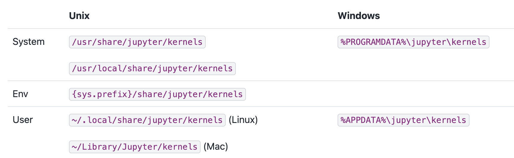
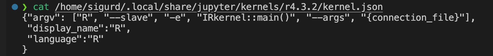
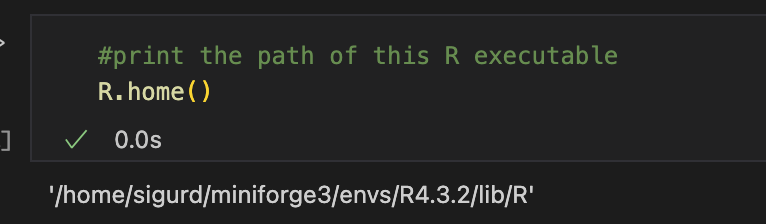

# Install Jupyter Lab in the base environment.
我默认大家都在使用conda来管理环境，即便你使用别的环境管理工具，我想原理也是一样的。你应该做的是将jupyter lab安装在你的基础环境中，并通过kernel spec来写清楚你的kernel在哪。

```bash
conda install jupyterlab
```

# How can a kernel be detected by jupyter server?


A kernel identifies itself to IPython by creating a directory, the name of which is used as an identifier for the kernel. These may be created in a number of locations:

内核通过创建一个目录来向IPython标识自己，该目录的名称被用作内核的标识符。你可以在以下任意位置创建：


Although you will hardly ever manually create these directories and the specs inside, understanding the principles will help you debug when encountering problems that cannot be solved.

尽管你几乎永远不会手动创建这些目录以及里面的spec， 但了解原理有助于你在碰到无法解决的问题时进行debug.

The user location takes priority over the system locations, and the case of the names is ignored, so selecting kernels works the same way whether or not the filesystem is case sensitive. Since kernelspecs show up in URLs and other places, a kernelspec is required to have a simple name, only containing ASCII letters, ASCII numbers, and the simple separators: - hyphen, . period, _ underscore.

用户位置优先于系统位置，并且名称的大小写不敏感。这些目录名仅允许包含ASCII字母、ASCII数字和简单分隔符：连字符-、句点.、下划线_。

Other locations may also be searched if the JUPYTER_PATH environment variable is set.

如果设置了 JUPYTER_PATH 环境变量，还可以搜索这些位置。

Inside the kernel directory, three types of files are presently used: kernel.json, kernel.js, and logo image files. Currently, no other files are used, but this may change in the future.

在内核目录中，目前使用三种类型的文件：kernel.json、kernel.js 和 logo 图像文件。

Inside the directory, the most important file is kernel.json. This should be a JSON serialised dictionary containing the following keys and values:

在目录中，最重要的文件是kernel.json。这应该是一个JSON序列化字典，包含以下键和值：

argv: A list of command line arguments used to start the kernel. The text {connection_file} in any argument will be replaced with the path to the connection file.

argv：用于启动内核的命令行参数列表。 任何参数中的文本{connection_file}将被替换为连接文件的路径。

display_name: The kernel’s name as it should be displayed in the UI. Unlike the kernel name used in the API, this can contain arbitrary unicode characters.

display_name：在用户界面中显示的内核的名称。与 API 中使用的内核名称不同，此处可以包含任意 Unicode 字符。

language: The name of the language of the kernel. When loading notebooks, if no matching kernelspec key (may differ across machines) is found, a kernel with a matching language will be used. This allows a notebook written on any Python or Julia kernel to be properly associated with the user’s Python or Julia kernel, even if they aren’t listed under the same name as the author’s.

language：内核语言的名称。加载笔记本时，如果找不到匹配的内核规范键（可能在不同机器上有所不同），则将使用具有匹配语言的内核。这允许任何 Python 或 Julia 内核编写的笔记本与用户的 Python 或 Julia 内核正确关联，即使它们未列在作者相同名称下也是如此。

interrupt_mode (optional): May be either signal or message and specifies how a client is supposed to interrupt cell execution on this kernel, either by sending an interrupt signal via the operating system’s signalling facilities (e.g. SIGINT on POSIX systems), or by sending an interrupt_request message on the control channel (see Kernel interrupt). If this is not specified the client will default to signal mode.

env (optional): A dictionary of environment variables to set for the kernel. These will be added to the current environment variables before the kernel is started. Existing environment variables can be referenced using ${<ENV_VAR>} and will be substituted with the corresponding value. Administrators should note that use of ${<ENV_VAR>} can expose sensitive variables and should use only in controlled circumstances.

metadata (optional): A dictionary of additional attributes about this kernel; used by clients to aid in kernel selection. Metadata added here should be namespaced for the tool reading and writing that metadata.

For example, the kernel.json file for IPython or R looks like this:

例如，IPython 或者R的 kernel.json 文件如下所示：

```json
{
 "argv": ["<absolute path to python executable>", "-m", "IPython.kernel",
          "-f", "{connection_file}"],
 "display_name": "Python 3",
 "language": "python"
}
```

```json
{"argv": ["<absolute path to R executable>", "--slave", "-e", "IRkernel::main()", "--args", "{connection_file}"],
 "display_name":"R4",
 "language":"R"
}
```

# Install the kernel For R environment.

```bash
conda create -n R4.3.2 r-base==4.3.2 r-tidyverse r-irkernel
conda activate R4.3.2
R
```

Find the default spec path of irkernel in R using the following command:

通过下列命令在R中找到irkernel的默认spec路径：

```R
system.file('kernelspec', package = 'IRkernel')
```
Something like this:
"/home/xxxxxx/miniforge3/envs/R4.3.2/lib/R/library/IRkernel/kernelspec"

Then you can execute the following command in the base environment to write this kernel spec to the corresponding location (Remember to replace the path with the path output by your previous command.):

然后你可以在base环境中执行以下命令将这个kernel spec写入到对应的位置（记得把路径替换为你上一条命令输出的路径。）：

```bash
jupyter kernelspec install /home/xxxxxx/miniforge3/envs/R4.3.2/lib/R/library/IRkernel/kernelspec --name 'R4.3.2' --user
```
Check if the installation is successful:

检查是否安装成功：
```bash
jupyter kernelspec list
```


```bash
cat /home/sigurd/.local/share/jupyter/kernels/r4.3.2/kernel.json
```

You can see that the display_name is R, we should change it to R4.3.2 (or any other name you want) to distinguish it from other R kernels. You should also change the path of R to an absolute path, because R cannot be found in the base environment.

你可以看到display_name是R，我们应该将其改为R4.3.2（或者任何你想改的），以便与其它R kernel进行区分。你还应该将R的路径改为绝对路径，因为在base环境中是找不到R的。

In vscode, you can open this file by pressing Ctrl+O (Command+O) and entering the path of kernel.json, then change it to:

在vscode中，你可以通过Ctrl+O(Command+O)并输入kernel.json的路径来打开这个文件，并更改为：
```json
{
 "argv": ["/home/xxxxxx/miniforge3/envs/R4.3.2/bin/R", "--slave", "-e", "IRkernel::main()", "--args", "{connection_file}"],
 "display_name": "R4.3.2",
 "language": "R"
}
```
After saving, open an ipynb file and select Kernel -> Jupyter Kernel -> Refresh (a curved arrow) to check if the Jupyter server can find this kernel.

保存后，通过打开一个ipynb文件，选择内核->Jupyter Kernel->刷新（一个弧形的箭头）检查jupyter server是否能够找到这个kernel.

You can check if the R used by this kernel is correct:

你可以检查这个kernel用的R是否正确:
```R
R.home()
```



By doing this, you can install multiple R kernels as long as you change the paths in display_name and argv.

通过这种方式，你可以安装多个R kernel，只要你更改了display_name和argv中的路径即可。
```bash
conda create -n R4.2.2 r-base==4.2.2 r-tidyverse r-irkernel
conda activate R4.2.2
R
```
```R
system.file('kernelspec', package = 'IRkernel')
```
```bash
jupyter kernelspec install /home/xxxxxx/miniforge3/envs/R4.2.2/lib/R/library/IRkernel/kernelspec --name 'R4.2.2' --user
```
Adjust the kernel.json file in the same way as above.
...

Finally,


